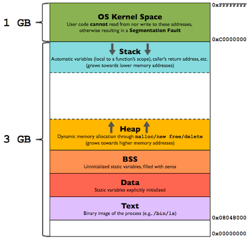
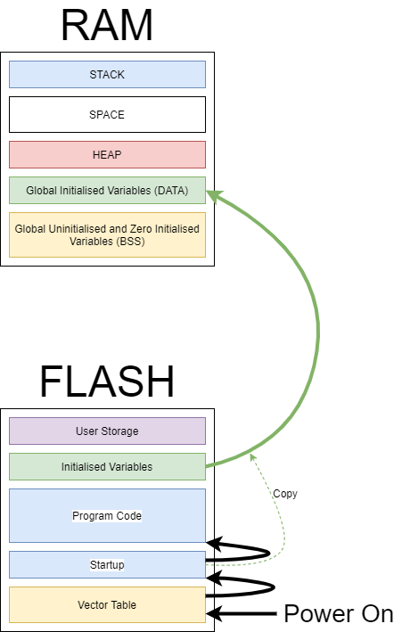

+ Một chương trình:
  + Code
  + Data
+ Code sẽ được lưu trữ ở phần .text trong FLASH
+ Data sẽ được lưu trong FLASH hoặc RAM
  + Ví dụ nếu là data const thì lưu trữ trong FLASH vì lưu trữ trong RAM không có ý nghĩa
  + FLASH mặc định xem là bộ nhớ chỉ ghi
  + RAM là đọc ghi
+ Phần .rodata cũng sẽ không lưu trữ trong RAM, vì rodata lưu trữ hằng số của chương trình
+ Các biến bình thường sẽ lư trong bộ nhớ đọc ghi được vì nó có thể thay đổi trong lúc runtime

File object:
    .data: Lưu trữ các biến đã được khởi tạo    => SRAM
    .bss: Lưu trữ các biến chưa được khởi tạo    => SRAM
    .rodata: Lưu trữ các hằng số read only     => FLASH
    .text: Lưu trữ mã chương trình             => FLASH
    User define sections: phần do người dùng tạo ra, tùy mục đích => FLASH

VMA (Virtual Memory Address) và LMA (Load Memory Address) là hai khái niệm quan trọng trong quá trình liên kết (linking) và nạp (loading) chương trình:

VMA: Là địa chỉ bộ nhớ ảo mà section sẽ được nạp vào khi chương trình chạy. Đây là địa chỉ mà code sẽ thực sự truy cập khi thực thi.

LMA: Là địa chỉ bộ nhớ vật lý nơi section được lưu trữ trước khi chương trình chạy. Ví dụ, section .data có thể được lưu trong FLASH (LMA) nhưng sẽ được copy sang SRAM (VMA) khi khởi động.

Trong file object (.o), cả VMA và LMA đều là 0x00000000 vì linker chưa quyết định địa chỉ cuối cùng. Các địa chỉ thực sẽ được xác định trong quá trình linking để tạo file thực thi.

MEMORY LAYOUT

[Bố trí bộ nhớ vi điều khiển - Shattered Silicon UK](https://shatteredsilicon.co.uk/2021/01/22/microcontroller-memory-layout/)

Viết trong file start-up:

 file start -up có thể khởi động lại stack pointer và sau đó nhảy vào hàm main

* Startup file có trách nhiệm thiết lập môi trường phù hợp để code hàm main() chạy
* Chương trình trong startup file sẽ chạy trước hàm main()
* Startup file chứa bảng vector table, có thể khởi tạo start pointer
* Startup file có thể thay đổi vị trí của stack, nó chịu trách nhiệm chính về phần .data và .bss

Trách nhiệm chính:

    * Tạo bảng vector table cho MCU

    * viết code startup để khởi tạo .data và .bss trong SRAM

    * gọi hàm main()

# LINKER

- ENTRY: Chỉ định điểm vào của chương trình, thường là Reset_Handler
- MEMORY: Định nghĩa các vùng nhớ có sẵn trong hệ thống như FLASH, RAM
- SECTIONS: Định nghĩa cách sắp xếp các section (.text, .data, .bss) vào các vùng nhớ
- KEEP: Ngăn linker loại bỏ các section quan trọng ngay cả khi không được tham chiếu
- ALIGN: Căn chỉnh địa chỉ của section theo một giá trị cụ thể
- AT>: Chỉ định địa chỉ load time khác với địa chỉ run time của section
